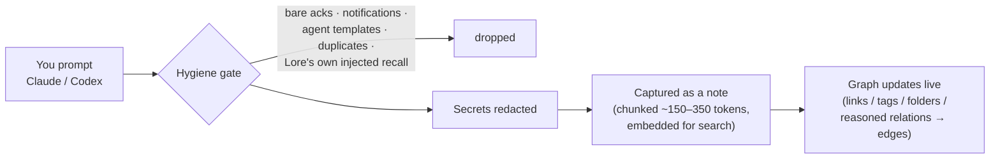
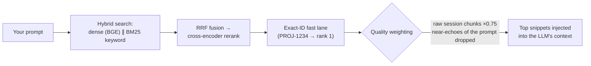
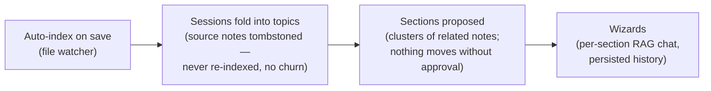

# How Lore Works

Lore runs entirely on your machine: it listens to your AI sessions, keeps only what's worth keeping,
and hands the right memories back to any LLM the moment they're relevant. This document walks the full
path — and answers where the data actually lives.

## Write path — when you talk to your AI

Every prompt/answer passes a **hygiene gate** before it can become memory. Noise never enters the
library; that's what keeps recall sharp months later.

The echo-loop rule matters most: recall that Lore itself injected into a prompt is stripped before
capture, so retrieved memories can never be re-stored as fresh knowledge.

## Read path — when you ask a question

Recall runs on a **hard 2-second budget**: it lands in time or steps aside — the LLM is never slowed.

Distilled knowledge outranks raw chat transcripts, and nothing that merely repeats the user's own
words is ever injected back.

## Upkeep — while you sleep

## What's installed with your LLM

Hooking Lore into a tool writes a handful of small, inspectable files — no daemons, no cloud
registration. Uninstall removes exactly these.

| Tool | What gets written | What it does |
|---|---|---|
| **Claude Code** | `~/.lore/hooks/lore-capture.js`, `lore-inject.js` + 4 entries in `~/.claude/settings.json` | Capture on prompt/tool-use/session-end; recall injected before every prompt |
| **Codex** | `~/.lore/hooks/lore-codex-notify.js` + `notify` line and `[mcp_servers.lore]` in `~/.codex/config.toml` | Turn-end capture (chains with any existing notifier); recall via MCP tools |
| **Any LLM** | MCP server (`lore_ask` / `lore_search` / `lore_graph`); in the packaged app this is the frozen backend binary in `mcp` mode — no Python needed | Cited answers + ranked search from any MCP-capable tool; a copy-paste HTTP recipe covers the rest |

## Source of truth

| Scope | Source of truth | Detail |
|---|---|---|
| **private** (solo) | **Your machine**: markdown files on disk for notes you write; local **SQLite** for everything Lore captures (agent sessions, edges, sections, wizards) | The Qdrant vector index is derived and rebuildable — never the truth. Delete it; Lore reconstructs it. |
| **team** (v1 design, not yet live) | **Team Postgres — only for shared notes**: notes marked `team` push one-way to the server; teammates pull read-only copies | One owner per note → no merge conflicts. Your local store stays authoritative for everything you own. |
| **enterprise** (future) | Same pattern, org-hosted | Scopes are enforced *inside* every query — retrieval can only see what the caller may see. |

> **Plain answer:** locally, your files + SQLite are the truth — nothing leaves the machine.
> When teams arrive, Postgres becomes the truth **only for notes you explicitly share**, in team and
> enterprise scopes. Private data never migrates.

### One engine, two dialects

`core/lore/db.py` is dialect-adaptive: the exact same query code runs **SQLite** (WAL, embedded, zero
services) on a laptop and **Postgres** on a deployed team server. That's the mechanism that lets the
source-of-truth story above stay one codebase instead of two products.
